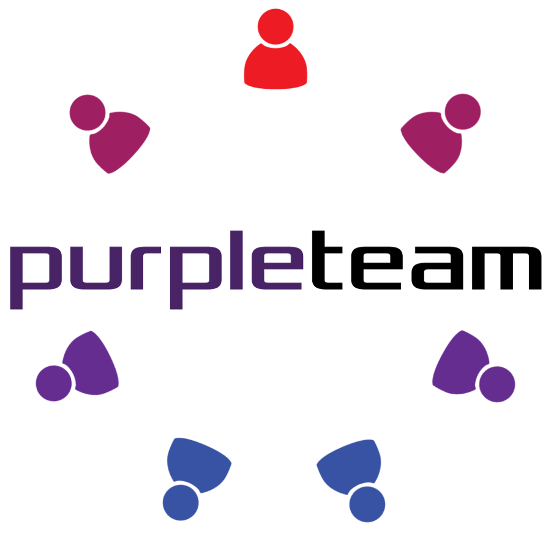
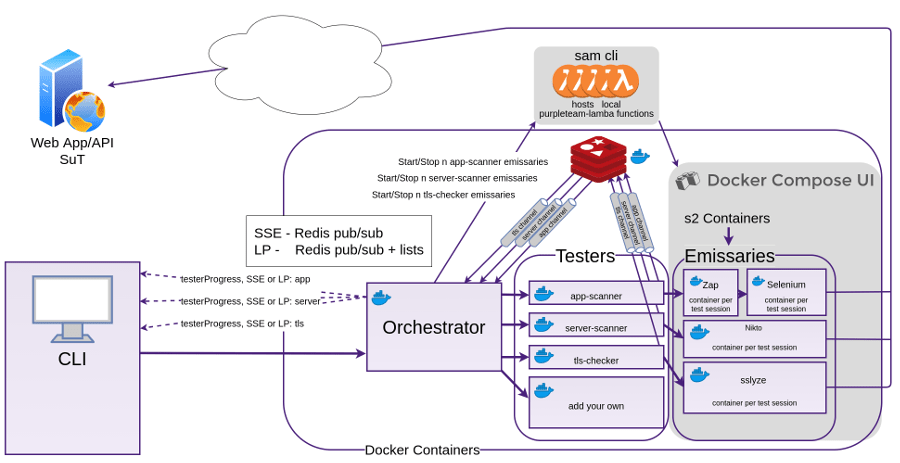

---

layout: col-sidebar
title: OWASP purpleteam
site_side: true
tags: example-tag
level: 4
type: tool
pitch: Web Security Regression Testing CLI & SaaS for your build pipeline

---

For more details about purpleteam see the main purpleteam-labs website at [purpleteam-labs.com](https://purpleteam-labs.com)

Many organisations spend many thousands of dollars on security defect remediation of the software projects they create. Usually this effort is also performed late in the development life-cycle, often even after the code is considered done. This fact makes the remediation effort very costly and often too short. Because of this there are many bugs left in the software that get deployed to production.

Purpleteam strikes at the very heart of this problem. Purpleteam is a CLI and back-end/API. The CLI can be run manually, but it's sweet spot is being inserted into Development Team's build pipelines, where it can find the security defects in your running web applications and APIs, and provide immediate and continuous notification of what and where your security defects are, along with tips on how to fix them.

The purpleteam back-end runs smart dynamic application security testing against your web applications or APIs. The purpleteam CLI drives the purpleteam back-end.

## Architectural Overview

### Redis

Redis pub/sub is used to transfer Tester messages (live update data) from the Tester micro-services to the Orchestrator. 
The Build User can configure the purpleteam CLI to receive these messages via Server Sent Events (SSE) or Long Polling (LP). The Orchestrator also needs to be configured to use either SSE or LP.
With Long Polling (LP) if the CLI goes off-line at some point during the Test Run and then comes back on-line, no messages will be lost due to the fact that the Orchestrator persists the messages it's subscribed to back to Redis lists, then pops them off the given list as a LP request comes in and returns them to the CLI. LP is request->response, SSE is one way. In saying that, LP can be quite efficient as we are able to batch messages into arrays to be returned.

### Orchestrator

The Orchestrator is responsible for:

* Organising and supervising the Testers
* Sending real-time Tester messages to the CLI via either SSE or LP
* Packaging and sending the outcomes (test reports, test results) back to the CLI as they become available
* [Validating, filtering and sanitising](https://f1.holisticinfosecforwebdevelopers.com/chap06.html#web-applications-countermeasures-lack-of-input-validation-filtering-and-sanitisation) the Build User's input

### Testers

Each Tester is responsible for:

* Obtaining resources, cleaning up and releasing resources once the Test Run is finished
* Starting and Stoping Stage Two Containers (hosted on docker-compose-ui) dynamically (via Lambda Functions hosted locally via sam cli) based on the number of Test Sessions provided by the Build User in the Job file which is sent from the CLI to the Orchestrator, then disseminated to the Testers
* The actual (app, server, tls, etc) test plan

### Sam Cli

Sam Cli stays running and listening for the Tester requests to run the lambda functions which start and stop the Stage Two Containers.

### docker-compose-ui

docker-compose-ui is required to be running in order to start/stop it's hosted containers (it has access to the hosts Docker socket).

